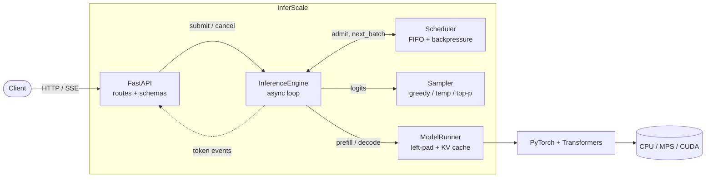

# InferScale

**A PyTorch LLM inference runtime built from first principles: hand-written decode loop, dynamic batching, KV caching, streaming, and an OpenAI-compatible API.**

[](https://github.com/Husqvarnalox/InterScale/actions/workflows/ci.yml)


<p align="center">
  
</p>

<sub>Real recording: `curl -N` against InferScale serving Qwen2.5-0.5B-Instruct on Apple MPS. Raw SSE lines are abbreviated for width (`id` elided) and playback is slowed ~2.5x; the whole stream took 0.83 s.</sub>

| | |
|---|---|
| **Manual decoding** | own prefill → sample → decode loop over `model(...)`; no `generate()` in the runtime |
| **Batching** | FIFO scheduler, bounded queue with backpressure (429), batched token-by-token decode with early row eviction |
| **KV caching** | standard Hugging Face KV cache owned per batch behind a swappable `BatchState` interface |
| **OpenAI-compatible API** | `/v1/chat/completions` and `/v1/completions`, JSON + SSE streaming, `usage`, cancellation on disconnect |
| **Observability** | Prometheus metrics (TTFT, TPOT, batch size, forward time), structured logs, benchmark client |

```bash
pip install -e ".[dev]"
inferscale serve --model Qwen/Qwen2.5-0.5B-Instruct     # or: --model builtin:tiny (offline smoke test)
curl -N localhost:8000/v1/chat/completions -H 'content-type: application/json' \
  -d '{"messages":[{"role":"user","content":"Hi!"}],"stream":true}'
```

Runs on CUDA, Apple MPS or CPU. About 1.7k lines in `src/inferscale`; the engine is meant to be read.
**Honest scope:** this is an educational runtime, not a vLLM replacement. v0.1 does dynamic batching, **not** continuous batching, and has no PagedAttention ([details](#what-inferscale-is-not)).



## Why?

Most people meet LLM serving through `model.generate()` or a large framework. InferScale
shows what sits in between: how a request becomes a batch, why prefill and decode differ, who
owns the KV cache, and what to measure. Transformers is used only for model and tokenizer
loading and the forward pass.

## Features

- Own prefill/decode loop (`model(...)`, never `generate()` in the runtime) with the standard
  Hugging Face KV cache (`past_key_values`)
- Scheduler with FIFO admission, bounded queue (HTTP 429), max batch size, cancellation
- Dynamic batched decoding over left-padded batches; finished/cancelled rows are evicted
  from the batch's KV cache mid-run
- Own sampler: greedy, temperature, top-p, top-k (extension), per-request `seed`
- EOS, `max_tokens`, `stop` strings (with hold-back so partial stop strings never leak)
- Non-streaming and SSE streaming (true deltas); optional `stream_options.include_usage`
- Client-disconnect cancellation for streaming and non-streaming requests
- Prometheus metrics, key=value logs (prompts are never logged)
- Device/dtype auto-selection with safe fallbacks; CLI > env > defaults config
- Benchmark client, CPU Dockerfile, CI, tests that need no GPU and no model download

## What InferScale is not

- Not a vLLM/TGI replacement and not meant for production traffic.
- No PagedAttention, KV block allocator, prefix caching or KV swapping.
- No tensor/pipeline parallelism, no distributed inference, no quantization.
- **No continuous batching.** See [Scheduling](#scheduling).
- No authentication, TLS or other production security guarantees (see [SECURITY.md](SECURITY.md)).

## Architecture

See the diagram at the top. Dependency direction is `api → engine → model`. The API layer never calls `model(...)`;
the engine never imports FastAPI. Details: [docs/ARCHITECTURE.md](docs/ARCHITECTURE.md).

## Request lifecycle

1. A route tokenizes the prompt and calls `engine.submit(...)`. Queue full → **429**;
   prompt ≥ `max_model_len` → **400**.
2. The request (`WAITING`) joins the scheduler queue; the engine loop is woken.
3. The loop pulls up to `max_batch_size` requests in arrival order; they become `RUNNING`.
4. The runner prefills the batch; each step the engine samples one token per row, detokenizes
   incrementally, applies stop conditions and pushes `StreamEvent`s into each request's queue.
5. The HTTP handler consumes that queue (SSE chunks or one aggregated JSON body).
6. Terminal states: `FINISHED`, `CANCELLED` (client disconnect or explicit cancel), `FAILED`.

## Scheduling

> **v0.1 implements dynamic token-level batched decoding; true iteration-level continuous
> admission is planned for v0.2.**

The scheduler forms a batch from the queue (FIFO, up to `max_batch_size`). That batch is
prefilled together and decoded token-by-token. Rows that finish or are cancelled are removed
from the batch and from the KV cache, so they stop consuming compute. But **new requests do
not join a batch that is already running**; they wait for the whole batch to finish. A long
generation therefore delays queued requests (head-of-line blocking at batch granularity).
This is *not* continuous batching in the vLLM/Orca sense.

## Prefill vs decode

- **Prefill**: `ModelRunner.prefill` runs all prompts (left-padded to the longest, with an
  attention mask and explicit `position_ids`) in one forward pass and returns the last-position
  logits plus the populated KV cache. Compute-bound.
- **Decode**: `ModelRunner.decode` feeds one token per row with the cache; only that token's
  K/V are computed and appended. Memory-bandwidth-bound.

See [docs/INFERENCE.md](docs/INFERENCE.md).

## KV cache

Implemented: the standard Transformers `DynamicCache`, held per batch in `HFBatchState`
(owned by the running batch, freed when the batch ends), with row eviction via
`batch_select_indices`. The engine only sees the opaque `BatchState` protocol, so a different
cache implementation can be slotted in behind `ModelRunner`.

Not implemented: PagedAttention, a KV block allocator, prefix caching, KV swapping. Caveat:
left-padding columns stay in the cache for the batch's lifetime, and cache memory is not
pre-reserved or admission-controlled, so oversized batches × long contexts can OOM.

## API

| Endpoint | Notes |
|---|---|
| `GET /health` | 200 `{"status":"ok"}`, 503 if the engine is down |
| `GET /metrics` | Prometheus text format |
| `GET /v1/models` | the single served model |
| `POST /v1/completions` | `prompt` (string or one-element list) |
| `POST /v1/chat/completions` | `messages` with roles system/user/assistant |

Supported parameters: `max_tokens`, `temperature` (0–2, 0 = greedy), `top_p`, `top_k`
(extension), `stop` (≤4), `seed`, `stream`, `stream_options.include_usage`, `model` (accepted
and ignored). `n` must be 1. Unsupported: logprobs, tools, `echo`, `best_of`, penalties.
Defaults: `max_tokens` 16 (completions) / 256 (chat). Responses carry `usage` and an
`X-Request-Id` header. Errors use the OpenAI shape `{"error": {message, type, code}}`;
validation → 400, queue full → 429, engine error → 500. Chat uses the tokenizer's chat
template when it has one; otherwise a simple `<|role|>\ncontent\n` fallback format.

```bash
curl localhost:8000/v1/chat/completions -H 'content-type: application/json' -d '{
  "messages": [{"role": "user", "content": "Say hi in five words."}],
  "max_tokens": 32, "temperature": 0.7, "stream": true }'
```

## Quickstart

```bash
git clone <your-fork-url> inferscale && cd inferscale
python -m venv .venv && source .venv/bin/activate
pip install -e ".[dev]"
```

Fast offline smoke test (random-weight ~100k-parameter model; output is gibberish by design):

```bash
inferscale serve --model builtin:tiny
```

A real small instruct model (downloads ~1 GB on first run):

```bash
inferscale serve --model Qwen/Qwen2.5-0.5B-Instruct --device auto --max-batch-size 8
```

Docker (CPU):

```bash
docker build -t inferscale .
docker run -p 8000:8000 inferscale
```

The image downloads the model from Hugging Face at first start; `docker-compose.yml` mounts a
cache volume. CUDA images are not provided in v0.1.

## Configuration

Precedence: CLI flag > environment variable > default. `.env.example` lists the variables;
InferScale does not load `.env` files itself.

| CLI flag | Env var | Default |
|---|---|---|
| `--model` | `INFERSCALE_MODEL` | `Qwen/Qwen2.5-0.5B-Instruct` (`builtin:tiny` for offline) |
| `--device` | `INFERSCALE_DEVICE` | `auto` (CUDA → MPS → CPU) |
| `--dtype` | `INFERSCALE_DTYPE` | `auto` |
| `--max-batch-size` | `INFERSCALE_MAX_BATCH_SIZE` | 8 |
| `--max-queue-size` | `INFERSCALE_MAX_QUEUE_SIZE` | 64 |
| `--max-model-len` | `INFERSCALE_MAX_MODEL_LEN` | 2048 (capped by the model's own limit) |
| `--host` / `--port` | `INFERSCALE_HOST` / `INFERSCALE_PORT` | `127.0.0.1` / 8000 |
| `--log-level` | `INFERSCALE_LOG_LEVEL` | `info` |

dtype `auto`: bfloat16/float16 on CUDA, float16 on MPS, float32 on CPU. Explicit float16 on CPU
is upgraded to float32 and bfloat16 on MPS downgraded to float16, each with a warning.
`max_tokens` is clamped so prompt + completion ≤ `max_model_len`.

## Benchmarking

```bash
python benchmarks/benchmark.py --url http://localhost:8000 \
  --requests 50 --concurrency 8 --max-tokens 64 --stream
```

Reports total/failed requests, requests/sec, tokens/sec, P50/P95/P99 latency and (with
`--stream`) average TTFT. Format only; **numbers below are illustrative, not measured results**:

```text
InferScale benchmark (stream, concurrency=8)        <- EXAMPLE FORMAT
----------------------------------------------------
total requests        50
failed requests       0
wall time (s)         <seconds>
requests/sec          <value>
tokens/sec            <value>
P50 latency (s)       <value>
...
```

Run it yourself on your hardware; results depend heavily on device, model and batch size.

## Metrics

`GET /metrics`, one registry per engine, no per-request labels.

| Metric | Type |
|---|---|
| `inferscale_requests_total{status}` (finished/cancelled/failed/rejected) | counter |
| `inferscale_requests_active`, `inferscale_queue_depth` | gauge |
| `inferscale_request_latency_seconds` | histogram |
| `inferscale_time_to_first_token_seconds` (from request creation) | histogram |
| `inferscale_time_per_output_token_seconds` (per request, after first token) | histogram |
| `inferscale_prompt_tokens_total`, `inferscale_generated_tokens_total` | counter |
| `inferscale_batch_size` | histogram |
| `inferscale_model_forward_seconds{phase=prefill\|decode}` | histogram |

Forward timings synchronize CUDA/MPS right after the forward; the logits are needed
immediately afterwards, so this adds no extra stall.

## Development

```bash
pip install -e ".[dev]"
ruff check . && ruff format --check . && mypy && pytest -q
```

Layout: `src/inferscale/{api,engine,model,metrics}`, `tests/`, `benchmarks/`, `docs/`.

## Tests

`pytest -q` runs on CPU with no network. Coverage: sampler (greedy/temperature/top-p/top-k),
request state machine, scheduler (FIFO, batch limit, queue full, cancellation), stop/EOS
handling, **the batched left-padded KV-cached decode matches `model.generate` token-for-token**
(the only place `generate` is used, as a reference), engine (EOS, `max_tokens`, streaming,
cancellation, failure isolation, shutdown) and the HTTP API (validation, 429, SSE, metrics).
Engine tests use a scripted runner; one test runs the real tiny Llama.

## Current limitations

- No continuous batching; head-of-line blocking at batch granularity (see Scheduling).
- Left-padding wastes compute/memory when prompt lengths differ widely; sampling runs per row.
- One model per process; one batch in flight; no KV memory admission control.
- Prompts are not truncated (rejected with 400 when too long); `n>1`, logprobs, tools unsupported.
- `usage.completion_tokens` excludes the EOS token.
- Streaming chunk boundaries follow tokens, but text is withheld while a character is incomplete
  or may begin a stop string.
- Not hardened for untrusted networks.

## Roadmap

See [docs/ROADMAP.md](docs/ROADMAP.md): v0.2 iteration-level continuous batching and prefix
caching; v0.3 paged KV cache, speculative decoding, quantization experiments.

## License

Apache-2.0.
